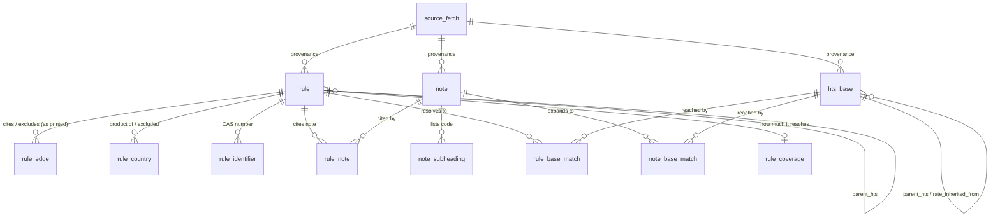

# Schema reference

Every table and column in [`db/schema.sql`](../db/schema.sql): what it holds, and **when
it is actually used**. The reasoning behind each shape is in
[`DECISIONS.md`](DECISIONS.md); the evidence it argues from is in
[`DATA_INVENTORY.md`](DATA_INVENTORY.md). Counts are from release **2026HTSRev16**.

---

## 1. The one idea

A tariff schedule is prose. Turning it into rows means deciding what the prose means, and
those decisions are sometimes wrong. So the schema keeps them separate from the text they
came from.

```
        SOURCE                 FACT LAYER                  INTERPRETATION LAYER
   what USITC published    what the text says          what we concluded it means

   ch99.json          →    rule                   ┐
                           rule_edge              │
                           rule_country           ├──→   rule_base_match
                           rule_identifier        │      (rebuildable, disposable)
   ch99-notes.pdf     →    note                   │
                           note_subheading        ┘
                           rule_note
   base.json          →    hts_base

                           parse_issue  ←──  everything that fit none of the above

        EDITORIAL                  DERIVED FOR THE APP
   attributable to this file     rebuilt every parse run

   trade_programme               rule_coverage
```

Three consequences worth stating up front:

- **`rule_edge.target_hts` is not a foreign key.** It stores `2922.49.30` exactly as
  printed — an 8-digit code matching no row in `hts_base`, and occasionally a code that no
  longer exists. A foreign key would force the parser to discard the citations most worth
  investigating.
- **`rule_base_match` and `note_base_match` can be dropped and rebuilt** from `rule_edge`
  and `note_subheading` without re-reading a sentence of prose. If the matcher has a bug,
  nothing upstream is re-parsed.
- **`parse_issue` is expected to be non-empty.** An empty one after a full run means the
  parser is not checking, not that the data is clean.
- **One table holds no source text at all.** `trade_programme` is an attribution this
  project makes, not a reading of a payload (D-0045), so it sits apart and every surface
  showing it has to say so. D-0055 records two further tables that were built on the same
  principle, measured, and removed.

## 2. Table map



| Table | Rows | Layer | Holds | Who reads it |
| --- | ---: | --- | --- | --- |
| `source_fetch` | 3 per run | provenance | Which download each row came from | A reviewer asking where the data is from; diagnosing two runs that disagree |
| `hts_base` | 26,246 | fact | Chapters 1–97: the codes goods are classified under | Step one of every duty calculation |
| `rule` | 3,098 | fact | Chapter 99 provisions: what modifies those duties | Step two of every duty calculation |
| `rule_edge` | 14,229 | fact | The codes a provision names, unresolved | Auditing the matcher; following exclusions |
| `rule_country` | 422 | fact | The countries a provision names | The moment a user types "China" |
| `rule_identifier` | 1,229 | fact | CAS numbers | Choosing between several provisions on one base code |
| `note` | 345 | fact | U.S. notes from the PDF | A user asking "on what authority" |
| `rule_note` | 977 | fact | A provision citing a note | Jumping from a provision to the legal text |
| `note_subheading` | 48,053 | fact | The codes a list-type note prints | Working out what Section 301 covers |
| `rule_base_match` | 16,958 | **interpretation** | The base rows a provision names itself | The main query once a user supplies a code |
| `note_base_match` | 136,325 | **interpretation** | The base rows a note's list reaches | The other half of that query, joined through `rule_note` |
| `rule_coverage` | 2,825 | derived | How many base codes a provision reaches, by each path | A duty page, which needs it for every provision at once (D-0047) |
| `trade_programme` | 7 | **editorial** | Which trade action a heading family belongs to | Naming "Section 301" on screen, which the schedule never does (D-0045) |
| `parse_issue` | non-empty | honesty | Everything that parsed into nothing | Self-review before submission; telling a user "I could not read this one" |

---

## 3. `source_fetch` — where the bytes came from

Written by Part 1, one row per source per run.

| Column | Meaning | When it is used |
| --- | --- | --- |
| `id` | Surrogate key | The target of `source_fetch_id` on the parsed tables — "which batch is this row from" |
| `run_id` | The Hatchet run | One of three sources failed; this groups the three rows to look at together |
| `source_key` | `ch99` \| `base` \| `notes_pdf` | Looking only at how the PDF fetch went |
| `release_name` | `2026HTSRev16` | **Answering "which revision is your data" at submission.** The HTSUS is revised several times a year, so the question will be asked |
| `release_title` | `Revision 16 (2026)` | Shown in the UI footer; more readable than the name |
| `url` | The exact URL requested | A reviewer reproducing the fetch: paste it into curl |
| `path` | Where the payload landed | Opening the raw file when the parser errors on it |
| `status` | `fetched` \| `unchanged` \| `skipped` \| `failed` | **Proving idempotency**: a second run that is all `unchanged` downloaded the bytes and found them identical — a verification, not a no-op. `skipped` means the endpoint could not serve the pinned release and the file on disk was preserved (D-0011) |
| `http_status` | The response code | Telling "404, do not retry" from "503, do retry" |
| `bytes` | Byte count | Spotting a truncated payload at a glance — 10 MB that arrived as 2 KB |
| `sha256` | Content hash | **The idempotency test itself** — these endpoints send no ETag, so identity is content-addressed |
| `duration_ms` | How long it took | Sizing Hatchet's `execution_timeout` against the real distribution |
| `error` | Why it failed | The first field to read when a run goes red |
| `fetched_at` | When | "As of when is this rate correct" |

---

## 4. `hts_base` — chapters 1–97

The schedule goods are actually classified under. Chapter 99 never changes a
classification; it changes what that classification costs.

**One row per code.** The 5,614 rows in the export with no code are heading rows: not
classifiable, carrying no rate, so their prose is folded into their descendants (D-0012).

### Identity and structure

| Column | Meaning | When it is used |
| --- | --- | --- |
| `hts` | The code, `2922.49.30.00`. Digits 1–6 are the international HS code, 7–8 the **US legal subdivision that sets the rate**, 9–10 statistical only | Primary-key lookup when a user supplies a code; also the number written on a customs entry |
| `parent_hts` | Nearest ancestor carrying a code | ① walking up for rate inheritance ② **Part 3's classification tree: asking from the 4-digit heading down to 10 digits**, one `WHERE parent_hts = ?` per level |
| `indent` | Nesting depth 0–5, as the export states it | Rebuilding the tree; afterwards mostly for **validation** — a parent's code must be a dotted prefix of its child's, and a violation goes to `parse_issue` |
| `description` | The row's own prose | Showing "this is the level you picked"; what a classification dispute is fought over |
| `full_description` | Ancestor prose joined onto its own | **`2922.49.49.50` reads only "Other".** A user searching "amino acid" finds it only with the ancestors attached. **Part 3's full-text search runs on this column** |
| `units` | Reporting units, `{kg}` or `{doz.,kg}` | **A specific duty cannot be computed without it**: `15.4¢/kg` multiplied by what? 4,725 rows carry two units, which is why it is an array |

### Column 1 General — the rate most importers pay

`rate_kind` is the **operator**; the three columns after it are its **operands**. That
split is what makes a duty computable rather than merely displayable (D-0013).

| `rate_text` | `rate_kind` | pct | amount | unit |
| --- | --- | ---: | ---: | --- |
| `Free` | `free` | 0 | | |
| `2.5%` | `replace` | 2.5 | | |
| `14.27¢/liter` | `replace` | | 0.1427 | `liter` |
| `4.4¢/kg + 8.5%` | `replace` | 8.5 | 0.044 | `kg` |
| `The rate applicable to each garment in the set` | `prose` | | | |

| Column | Meaning | When it is used |
| --- | --- | --- |
| `rate_text` | The string as printed. Always populated | **Always what the UI displays** — never our parsed number. A user checking the answer is checking it against the government's words |
| `rate_kind` | `free` \| `replace` \| `additive` \| `no_change` \| `prose` \| `none` | The calculator's switch. Base rows only ever use the first two and `prose`; the vocabulary is shared with `rule` so **one calculator serves both tables** |
| `rate_ad_valorem_pct` | Percent of declared value | `value × pct / 100` |
| `rate_specific_amount` | Dollars per unit — **cents are divided by 100**, so `46.3¢/kg` is stored as 0.463 and compares directly with `$1.104/kg` | `quantity × amount` |
| `rate_specific_unit` | The unit charged per | Reconciled against `units`; when they disagree, the answer says "declare the weight in kg" |
| `rate_inherited_from` | The ancestor the rate was copied from; NULL when the row states its own | **A user asks "where does 6.5% come from"; the UI answers "inherited from 2922.49.49".** 20,446 of 31,860 export rows inherit (D-0014) |

`free` is `replace` with pct 0, kept separate only because the schedule writes it as a
word — a calculation may ignore the distinction, a display should not.

### Column 2 — countries without normal trade relations

The same five columns, prefixed `col2_`, **plus its own `col2_inherited_from`**. Not a
duplicate of Column 1: on the same line the two differ by roughly eightfold.

| `hts` | `rate_text` | `col2_rate_text` |
| --- | --- | --- |
| `0101.29.00` | Free | 20% |
| `2922.49.30.00` | 6.5% | 15.4¢/kg + 50% |

| Column | When it is used |
| --- | --- |
| `col2_*` (five columns) | **Only when the country of origin is Cuba, North Korea, Russia or Belarus.** Reading the wrong column turns $6,500 into $50,000 on a $100,000 shipment |
| `col2_inherited_from` | Saying where a Column 2 rate came from, the same way `rate_inherited_from` does for Column 1. The two chains are separate because they disagree: `9006.59.15.20` states its own Column 2 (`20%`) while inheriting Column 1 from `9006.59.15`. Exactly **one row in 26,246**, which is precisely why sharing a single column would have been wrong and invisible |

That country list is **in none of the three sources** — it lives in the HTS General Notes.
It has to be hardcoded with a citation, or the answer has to say a human is needed.

### The rest

| Column | Meaning | When it is used |
| --- | --- | --- |
| `special_text` | Column 1 Special as printed: `Free (A+,AU,BH,CL,…)` | A user asks "does my trade agreement cover this" — **all we can do is show the text**, because decoding those codes needs the General Notes. A second, unrelated origin dimension: one grants relief, Chapter 99 imposes it, and a shipment can hit both |
| `source_fetch_id` | Which download | Provenance; also how "which revision is this rate" is answered |
| `full_description_tsv` | Generated `tsvector` | **The entry point when a Part 3 user types "stainless steel sheet".** A generated column rather than a trigger, so it cannot drift out of sync |

Indexes: `parent_hts` for tree walks; GIN over `full_description_tsv` for full text; GIN
`gin_trgm_ops` over `full_description` for **typos and unfamiliar wording**. Both
extensions ship with the stock Postgres image — pgvector does not, which is why nothing
here depends on embeddings.

---

## 5. `rule` — Chapter 99 provisions

The same rate model as `hts_base`, plus the two things Chapter 99 adds.

| Column | Meaning | When it is used |
| --- | --- | --- |
| `hts` | `9903.88.01`, `9902.04.06` | Primary key; shown as "you were hit by 9903.88.01" |
| `heading` | `9903` | Grouping: telling the Section 301 block from the Section 232 block at a glance |
| `subchapter` | `III` | Derived — the heading's last two digits **are** the subchapter number (9915 → XV). **Subchapter II is relief, III is increases**, so this is the first thing read when deciding alternatives versus stacking |
| `parent_hts` | Parent provision | Showing context: `9903.17.01` alone reads "first quota period" and means nothing without its ancestors |
| `indent` | Nesting depth | Building and validating the tree |
| `description` | Own prose | Showing the provision's own words |
| `full_description` | Ancestor chain plus own | **Citations, countries and CAS numbers are all extracted from this column**, not from `description`, because a provision inherits its ancestors' scope — that is how the schedule is read legally |
| `scope` | `by_code` \| `by_country_all_goods` \| `unknown` | **Decides which query path a rule takes.** See below; without it the model is wrong |
| `rate_*` (5 columns) | As `hts_base` | Computing the final duty |
| `additional_duty_*` (4 columns) | A second duty on top of `rate_*`, always additive | 512 provisions carry one, e.g. `66.6¢/kg`. **50 read "No additional duty" — a stated zero, not a missing value**, so the text is kept beside the number; otherwise it reads as "field absent" and gets skipped |
| `source_fetch_id` | Which download | Provenance |
| `full_description_tsv` | Generated column | Searching provisions for "steel China" |

### The two Chapter 99 operators

| `rate_text` | `rate_kind` | Effect |
| --- | --- | --- |
| `Free` | `free` | Replaces the base rate with zero — 1,364 provisions |
| `The duty provided in the applicable subheading` | `no_change` | The base rate stands; something else about the provision matters, usually a quota |
| `The duty provided in the applicable subheading + 25%` | `additive` (pct 25) | Base rate **plus** 25 points |
| `…applicable subheading plus 25%` | `additive` (pct 25) | Same thing, different spelling — `9903.88.01` uses this one |
| `100%` | `replace` (pct 100) | A flat rate regardless of the base |

The default in subchapter III is **replacement**, stated in note 1: duties apply "in lieu
of" the base rate. Additive treatment is the explicit exception, which is why note 2(a)
opens "Notwithstanding U.S. note 1 to this subchapter".

### Why `scope` exists

Of the 3,098 coded provisions:

| `scope` | Example | How it reaches goods |
| --- | --- | --- |
| `by_code` | `(provided for in subheading 2922.49.30)` | `rule_base_match` |
| `by_country_all_goods` | `articles the product of Mexico` | `rule_country` alone — **no join key to `hts_base` exists** |
| `unknown` | | Placed here rather than guessed |

**How many land in each is a resolver output, not a count that can be taken beforehand.**
2,571 provisions name a base code somewhere in their ancestor chain and 527 name none; of
those 527, 358 name a country. The rest cite a note, and a note only leads to base codes
when it is a *list of subheadings* — note 20(b) is, note 2(a) is not — which is not known
until the PDF is parsed.

What is certain by inspection: `9903.01.01` names no base code at all and covers *every*
good from Mexico, as does each of `9903.05.20`–`9903.05.84` for its own country.
Materialising those against all 26,246 base rows would cost millions of rows per provision;
leaving them out of the resolved layer would lose the most frequently applied duties in the
current schedule.

**The practical consequence: answering "what applies to this shipment" takes two queries,
not one.** A code query and a country query. Forgetting the second understates the duty on
Chinese goods by 25 points.

---

## 6. `rule_edge` — what a provision names

**Unchanged from the starting schema** — its design was already right.

| Column | Meaning | When it is used |
| --- | --- | --- |
| `source_hts` | The provision, FK to `rule` | |
| `edge_type` | `references` — "provided for in X" · `excludes` — "except for products of Y" | **`excludes` is what decides whether a provision still applies**: 214 provisions carry one, naming 859 other Chapter 99 codes between them, and exclusions form a graph, not a list. An exclusion is recognised by its lead-in (`Except for products described in …`, `Except as provided in …`), not by the word "except": 217 of the 431 "except" clauses in this revision are parentheticals inside a product description — `of bovine (except calfskin) leather` — and carve out nothing |
| `target_hts` | The code as printed. **No foreign key, no normalisation** | ① auditing `rule_base_match` against what was actually cited ② **the 50 unresolvable codes live here** — some are real codes retired in this revision, some are regex noise (`2022`, `0090`), and both are worth keeping |

---

## 7. `rule_country` — country of origin

| Column | Meaning | When it is used |
| --- | --- | --- |
| `rule_hts` | The provision | |
| `country_name` | As written: `Mexico`, `the People's Republic of China` | Quoting the provision's own words in the UI |
| `country_code` | ISO 3166-1 alpha-2, resolved against the register `pycountry` ships. 391 of 397 links carry one; the six without are all `European Union`, which is not a country and correctly has none | **A user types "China" → `CN` → this column is queried.** It is also what makes one country one key: the schedule writes `Russia` on two headings and `Russian Federation` on three, including the Section 232 steel pair, and only the code brings all five back together |
| `relation` | `product_of` \| `excluded` | **Only `product_of` occurs in this revision.** Four phrasings of a country carve-out (`other than products of`, `excluding products of`, …) return zero rows: reciprocal-tariff headings carve out *headings*, through `rule_edge`, not countries. `excluded` is kept because the distinction is real in principle and costs nothing, but nothing populates it and the UI must not imply otherwise |

Note 2(a) makes "country of origin" a defined term rather than a label: goods of Mexico
under 19 CFR part 102, **or** goods for which Mexico was the last country of substantial
transformation. The schema stores the country; whether a shipment qualifies is a question
this data cannot answer.

---

## 8. `rule_identifier` — which goods, when the code cannot say

| Column | Meaning | When it is used |
| --- | --- | --- |
| `rule_hts` | The provision | |
| `kind` | `cas` today | A CHECK constraint, so adding a kind is a deliberate act |
| `value` | `619-05-6` | **Choosing between several 9902 provisions on one base code.** A user who can state the CAS number turns candidates into an answer |

Of the 1,000 cited codes that resolve against the base export, **507 — 51% — are cited by
more than one provision**; `3808.92.15` is cited by 34. Not messy data: the base code is a bucket and a
9902 provision picks one substance out of it.

```
2922.49.30  "Products described in additional U.S. note 3 to section VI"   6.5%
  ├─ 9902.04.04  4-Chlorophenylglycine            CAS 6212-33-5   → 0.5%
  ├─ 9902.04.05  2-Amino-5-sulfobenzoic acid      CAS 3577-63-7   → Free
  ├─ 9902.04.06  3,4-Diaminobenzoic acid          CAS 619-05-6    → Free
  └─ 9902.04.07  Methyl 2-amino-3-chlorobenzoate  CAS 77820-58-7  → Free
```

**The classification does not choose between these — the identity of the goods does.** A
query keyed on base code plus country returns candidates, not an answer. 1,034 provisions
carry a CAS registry number — 1,028 distinct ones — exact and globally unique, so for those
the choice becomes a lookup (D-0019).

---

## 9. `note`, `rule_note`, `note_subheading` — the PDF

973 provisions cite a U.S. note, across 35 distinct numbers, and many take their scope
from it rather than from codes they name. `9903.88.01` covers "the subheadings enumerated in
U.S. note 20(b)", and that list exists **only in the PDF**.

**The number alone does not identify a note.** 689 of those citations point at a note "to
this subchapter" and 124 at an "additional U.S. note N to chapter N" — a different
collection reusing the same numbers. That is why the unique key below is the whole tuple.

### `note`

| Column | Meaning | When it is used |
| --- | --- | --- |
| `id` | Surrogate key | |
| `note_kind` | `chapter` \| `us_note` \| `statistical` | Filtering `statistical` out when only legal effect matters |
| `subchapter` | `III`, or NULL for chapter notes | The same number means different things under different subchapters; without this they collide |
| `note_number`, `subdivision` | `20` and `b` | Looking up the note after extracting "U.S. note 20(b)" from a provision |
| `label` | `U.S. note 20(b) to subchapter III` | The heading shown in the UI |
| `body` | Full text as extracted | **A user asks "on what authority am I charged 25%" — the answer is this text, verbatim** |
| `content_kind` | `prose` \| `subheading_list` \| `mixed` | Decides whether the note is expanded into codes. **This is a judgement the parser makes about a page of text**: a note classified `prose` that actually contains a list silently under-covers its provisions — the weakest link in the chain |
| `page_from`, `page_to` | Where it was found | **Letting a person check the PDF**; also the way into diagnosing a bad extraction |
| `source_fetch_id` | Which download | Provenance |

The unique key is `(note_kind, subchapter, note_number, subdivision)` with
`NULLS NOT DISTINCT`, so two chapter-level notes with no subdivision collide on the key
instead of both being inserted.

### `rule_note`

| Column | Meaning | When it is used |
| --- | --- | --- |
| `rule_hts` | The citing provision | |
| `cited_text` | What the description said: `U.S. note 20(b) to this subchapter` | **When nothing matched, this still records what was cited** |
| `note_id` | What it matched. **Nullable** | The one-hop jump from provision to legal text that the brief explicitly asks for. No match means NULL plus a `parse_issue` row |

Both layers in one table: `cited_text` is fact, `note_id` is interpretation.

### `note_subheading`

| Column | Meaning | When it is used |
| --- | --- | --- |
| `note_id` | The note | |
| `hts_prefix` | An 8-digit code as printed | **Working out what Section 301 covers**: `9903.88.01` names no codes itself and depends entirely on this table |
| `ordinal` | Position in the list | **Comparing the extraction against the PDF** — a missing code shows up as a gap in the sequence |

pypdf flattens the PDF's four-column table into runs of fixed-width codes —
`2845.90.012845.40.002845.30.00` — which split cleanly on `\d{4}\.\d{2}\.\d{2}` because
every code is exactly 10 characters.

---

## 10. `rule_base_match` and `note_base_match` — the interpretation layer

The only *derived* tables here. Drop both and they rebuild from `rule_edge` and
`note_subheading` without re-reading any prose.

There are two because a provision reaches base codes two ways, and the second one
multiplies. `rule_base_match` holds the codes a provision names itself — **16,958 rows**.
`note_base_match` holds the codes a *note* lists, expanded once per note rather than once
per provision that cites it — **136,325 rows**. Storing the note path per provision was
measured first: note 52 lists 4,166 codes and is cited by 98 provisions, note 2 lists 2,322
and is cited by 150, and the table came to roughly **4.7 million rows**, nearly all of them
the same expansion written again (D-0036).

| `rule_base_match` | Meaning | When it is used |
| --- | --- | --- |
| `rule_hts` | The provision | |
| `base_hts` | A base row it names. **A real foreign key** | **The main query once a user supplies a 10-digit code**: `WHERE base_hts = ?` |
| `cited_code` | The 8-digit string that produced this match | **Makes the derivation visible**: "you are in scope because the provision cited 7208.51" |
| `match_kind` | `exact` \| `prefix` | Showing confidence: `prefix` means the provision covers a whole family, worth confirming with the user |

| `note_base_match` | Meaning | When it is used |
| --- | --- | --- |
| `note_id` | The note whose list this came from | Joined through `rule_note` to reach the provisions that cite it |
| `base_hts`, `cited_code`, `match_kind` | As above | `note_id` is also the answer to "why" — it is the note whose text the UI quotes |

**A provision's full coverage is the union of two queries**, which is the same trade
D-0018 made for country-wide provisions: a second query in exchange for not materialising
a product.

```sql
SELECT rule_hts FROM rule_base_match WHERE base_hts = ?
UNION
SELECT n.rule_hts FROM rule_note n
  JOIN note_base_match m ON m.note_id = n.note_id
 WHERE m.base_hts = ?;
```

Matching is prefix matching **anchored at a separator**: a row matches when its code equals
the citation or extends it after a dot. A bare prefix test would let `2922.49.3` reach
`2922.49.30`. Expansion varies by three orders of magnitude, which is why it is
materialised rather than recomputed per query:

```
2922.49.30   →    1 base row
7208.51      →    4
4202         →  108      a 4-digit heading covers a whole product family
```

`rule.scope` is corrected here, not in the Chapter 99 parser: **343 provisions** were filed
as `by_country_all_goods` or `unknown` and became `by_code` once their note turned out to
be a list. The final split is 2,914 / 67 / 117.

---

## 11. `rule_coverage` and `trade_programme` — derived, and editorial

Two small tables that are not parsed from anything, and are not the same kind of thing.

**`rule_coverage`** is the only figure in this schema precomputed for speed. Counting one
provision's reach costs 4 ms, which is why D-0044 concluded no table was needed — and a duty
page never asks for one. A laptop from China matches 88 provisions, and counting all 88 in a
single query costs **1,568 ms**, more than three quarters of that page's response. Everything
else on it runs under 6 ms. D-0047 is about the difference between those two measurements.

| Column | Meaning | When it is used |
| --- | --- | --- |
| `rule_hts` | The provision | |
| `base_codes` | The union of both paths — a code reached twice is one code | The "reaches N base codes" line on every provision |
| `direct_codes` | Reached because the provision named the code itself | Telling a reader which half of the reach they can check in the provision's own text |
| `note_codes` | Reached through a note's list | The other half, which is only checkable by opening the PDF |

Rebuilt by the `materialize` task at the end of the parse run, in the same pass that writes
the tables under it, so it cannot describe a set of provisions that no longer exists.

**`trade_programme`** is the one table whose contents are in none of the three sources.
Measured: of 345 U.S. notes, exactly one names a statute, and it says "section 201" — the
schedule never writes "Section 301" or "Section 232" anywhere. So `+25%, articles the product
of China, as provided for in U.S. note 20(b)` tells a novice nothing about what it is, and an
app built to explain Chapter 99 to a novice cannot say.

| Column | Meaning | When it is used |
| --- | --- | --- |
| `heading_prefix` | The 6-digit family, `9903.88` | Joined as `left(rule.hts, 7)` |
| `label`, `statute`, `agency` | **Editorial.** Not checkable against this database | The chip on a provision, which must carry the word "editorial" |
| `evidence` | What the parsed rows say | Re-deriving the grouping without trusting it |
| `reference_url` | A Federal Register **search**, not a document id | A reader who wants the instrument itself |

Seven families are labelled, and only where the provisions state their own subject matter
*and* the attribution is public record. Families failing either test are absent rather than
guessed: `9903.89` and `9903.90` have no label. D-0045.

---

## 12. `parse_issue` — what did not parse

| Column | Meaning | When it is used |
| --- | --- | --- |
| `run_id` | The run that produced it | Looking only at the latest run's residue |
| `stage` | `base` \| `ch99` \| `notes` \| `resolve` | Locating which step dropped it |
| `issue_kind` | `unresolved_code`, `unparsed_rate`, `unresolved_note`, `parent_prefix_mismatch`, … | **Grouped, this is the list of "what I could not read"** — it goes into the submission directly |
| `subject` | The code or note the issue is about | **Warning the user in the UI**: "the rate on this provision did not parse; check it by hand" |
| `detail` | The offending fragment, verbatim | The first thing read when fixing the parser |
| `created_at` | When | |

Residue on this release, **848 rows**, and every group is a known limit rather than a
surprise:

| Stage | Kind | Rows | What it is |
| --- | --- | ---: | --- |
| `base` | `unparsed_rate` | 305 | Column 1 or 2 rates written as English sentences |
| `resolve` | `subdivision_not_segmented` | 277 | A citation named a subdivision the notes parser could not isolate from the PDF (D-0038) |
| `resolve` | `unresolved_code` | 226 | A cited code matching no row in this revision |
| `ch99` | `unnamed_country` | 36 | A country written in a form the pattern does not cover |
| `ch99` | `unparsed_rate` | 3 | Chapter 99 rates that are sentences (D-0022, P-k) |
| `resolve` | `unresolved_note` | 1 | A note citation matching no note |

Recorded rather than dropped (D-0017).

---

## 13. A query end to end

**"Steel from China, `7208.51.00`, $100,000."**

```sql
-- 1. the base duty
SELECT hts, rate_text, rate_ad_valorem_pct, rate_inherited_from
FROM   hts_base WHERE hts LIKE '7208.51.00%';

-- 2. provisions reaching it by code
SELECT r.hts, r.rate_kind, r.rate_ad_valorem_pct, m.match_kind, m.via
FROM   rule_base_match m JOIN rule r ON r.hts = m.rule_hts
WHERE  m.base_hts = '7208.51.00.30';

-- 3. provisions reaching it by country — the query that is easy to forget
SELECT r.hts, r.rate_kind, r.rate_ad_valorem_pct
FROM   rule r JOIN rule_country c ON c.rule_hts = r.hts
WHERE  r.scope = 'by_country_all_goods'
  AND  c.country_code = 'CN' AND c.relation = 'product_of';

-- 4. why, in the government's own words
SELECT n.label, n.body FROM rule_note rn JOIN note n ON n.id = rn.note_id
WHERE  rn.rule_hts IN (…);
```

Steps 2 and 3 are separate because they run on different keys. Step 4 is what turns a
number into an explanation.

**"$100,000 of `2922.49.30.00`."** Step 2 returns four candidate provisions, all valid, all
different. The schema cannot pick one; only knowing the substance can, which is what
`rule_identifier` is for.

---

## 14. What this schema deliberately cannot answer

| Question | Why not |
| --- | --- |
| Which of §232 and §301 applies first when both hit | **Not stated anywhere in the HTSUS.** CBP publishes it in CSMS messages; guessing would be worse than saying so |
| Is this provision still in force | **Partly answerable.** `effective_from`, `effective_to` and `status` are read from the provision's own prose, which states a date only when it is unusual (D-0043). The PDF's grey shading for an expired row is still destroyed by text extraction |
| Which countries get the Column 2 rate | In the HTS General Notes, not in any of the three sources |
| What `A+`, `KR`, `AU` mean in `special_text` | Same |
| What changed between Revision 15 and 16 | One revision is resident at a time (D-0020). The payloads are kept, so the answer is recoverable by re-parsing — just not queryable |
| Does this shipment qualify as "a good of Mexico" | A legal determination under 19 CFR part 102, not a data lookup |

Each of these is a place where the honest answer is "a human decides", and the schema is
shaped so the application can say that rather than fabricate a number.
